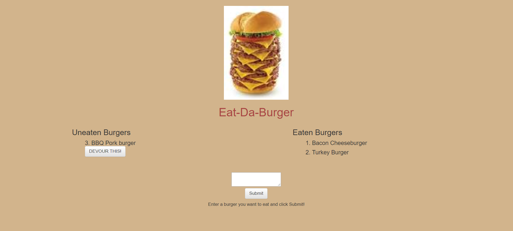

# Eat-Da-Burger!
A full stack burger-logger web app featuring the use of Node, Express server, Handlebars for view generation and ORM. Node and MySQL are used to query and route data flow in the app.

The app itself is fairly straightforward but the focus here was to practice MVC - data flow, routing, view generation, etc., in a full stack design.

Here is a screen shot of the front page:
